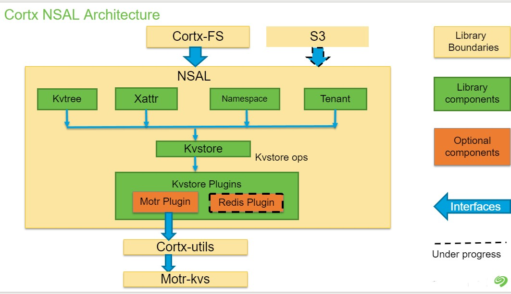

# High Level Overview

## Acrhitectural overview

## KVstore

KVstore gives capability of basic key-value storing.

KVstore acts as an entry point for all the components of NSAL to communicate with the cortx-motr APIs. The kvstore APIs will provide the basic interfaces. i.e. SET, GET, DELETE of key-value entries at the backend.  

Supported storage-plugin by kvstore-
 - cortx-motr

## KVtree

KVtree is a logical tree representation which can be used to store heirarchical data.
It is an in-memory object that can be created in a given namespace and works on a particular index created by namespace.
A kvtree always has at least one node (root) whose attributes are stored on disk.

Each KVtree object contains a list of `KVnodes`. Each kvnode present in the kvtree can have multiple children.

Note: Every kvtree has a namespace.

## KVnode

KVnode is an in-memory representation of a node. 
Every kvnode has a node ID which identifies it uniquely in the kvtree.
KVnode has two types of attributes:
1. Basic attribute 
2. System attribute

Both of these attributes are stored on-disk.
Basic attributes act as the "core" of a kvnode, without which it cannot exist.
System attributes are optional to the kvnode.

### Use-case: 

In a filesytem, 
- The "/" root directory can act as the root kvnode of a kvtree. 
- A file/directory/symlink can act as a kvnode.
- Metadata of a file i.e the stats can be the basic attribute of that particular kvnode.
- A kvnode which represents a symlink can use system attributes of that node to store symlink path.

## Extended Attributes (Xattrs)

Extended attributes are name:value pairs, where attribute names are `null-terminated strings`.

Extended attributes are accessed as atomic objects. Supported xattr operations are SET, GET, DELETE and LIST.

### Use-case:
Xattrs can be used to provide additional functionality to a filesystem—
- Additional security features such as Access Control Lists (ACLs)
- Storing arbitrary additional information such as the mime type, character set or encoding of a file.

Note: Xattrs are independent of KVTree/KVnode component.

## Namespace

Namespace acts as a `container` for a particular kvtree. All the data for a kvtree and its kvnodes are stored in this particular namespace (which creates an index).

For creating a kvtree, namespace has to be created. The index created by the namespace is then used by the kvtree.

All the namespaces(indexes) created are stored in a `global ns-meta index` in form of key-value pair.

## Tenant

Tenants are used to store export data. Tenant objects are stored in the same `global ns-meta index`. Every tenant object is uniquely identified via `tenant id` which is same as Export id.
